# Objective:
 
 - Create a Static website and host it on S3 bucket (private bucket) but with public read policy assigned, using cloudFront for CDN. 

 # Hosting a Static Website using AWS S3 and CloudFront.

**INTRODUCTION**

In this documentation, I would be deploying a one of the not-too-elaborate websites I wrote with just HTML and CSS, no javscript. I want to do this using Amazon S3 bucket as well as give it wings to fly using CloudFront as the content delivery network. The step-by-step process herein will help anyone who wants to achieve the same result at their own respective ends and convinience. To ensure a seamless process, make sure you have the files for your static website ready in some folders on your local machine.  

**DEFINITION OF TERMS**

**Static Website:** Any regular website can fit into this tag of a static website. A static website has no dynamic components. It just contains HTML files, CSS, images as well as javascript files. A static website cannot perform some dynamic or backend requests such as processing form data or retrieving information from a database. 


**Amazon S3:** This stands for Simple Storage System. It is an *Object Storage* service that allows you to store and retrieve data. It also provides you with virtually with an unlimited storage for all your file storage needs. 


**Amazon CloudFront:** This is a Content Delivery Network (CDN) service that accelerates the delivery of your website's contents to users around the world. It caches content at edge locations, reducing latency and improving speed. Amazon CloudFront is a fast content delivery network (CDN) service that securely delivers data, videos, applications, and APIs to customers globally with low latency and high transfer speeds.


# STEP 1 - CREATING A BUCKET ON AMAZON S3

1. Create an Amazon account and activate your account. After achieving this, ensure you are signed in with you own customized username. This should appear at the top right corner. In my case, I logged in as an IAM user and not the Root user. 


2. Navigate towards the top left corner on the AWS Console. On the **Services** search box, type "S3" to enable an easy search for the S3 service. Then click on it to launch the S3 dashboard.


3. On the S3 Dashboard, click on the create bucket button to create a new storage bucket to store your static website files.
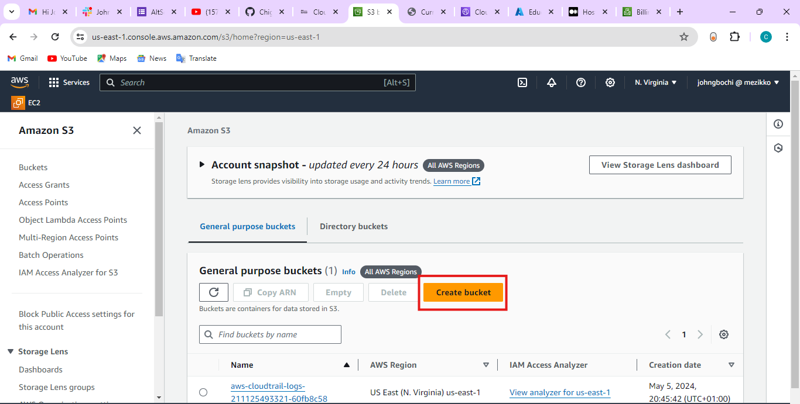


4.  Enter a bucket name on the space provided for it. The name should be unique to you so it doesn't clash with some existing names globally. Try another name incase the one you chose is already existing. 


5. Scroll down. Then make sure this box for "Block all public access" is ticked because we want to keep our bucket private and allow access only via CloudFront. If you untick the box, this will allow anyone to view your website.


6.  Leave all the other settings at their default and proceed to **Create bucket** button at the bottom of the page. 


# STEP 2 - UPLOADING YOUR FILES TO THE S3 BUCKET

7.  After creating a new bucket, see the details of the new bucket created by clicking on the bucket details.
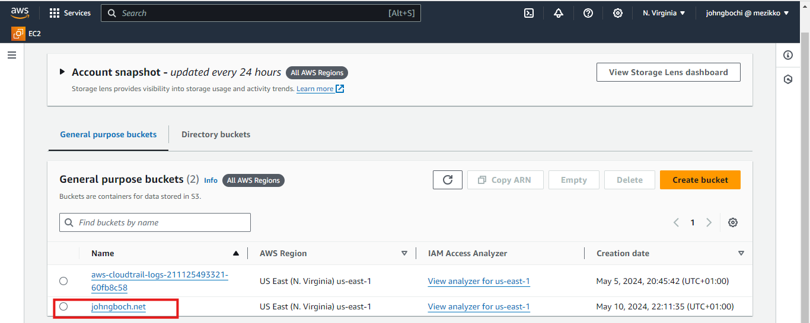


8.  Whenever you create a new bucket, it will always be empty. You need to add files to it then. Click on **Upload** button to upload some files. 
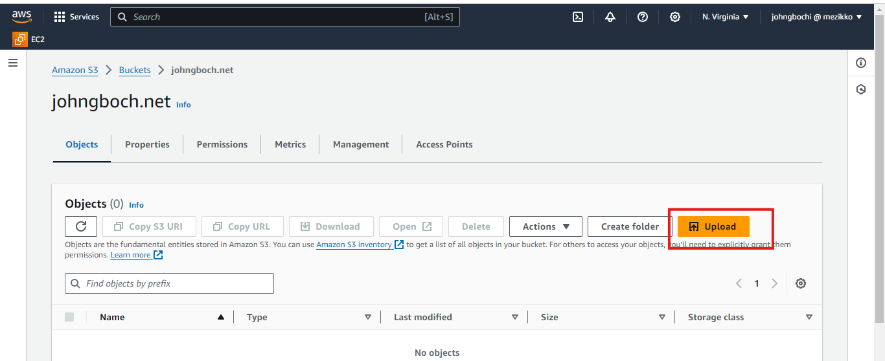


9.  When the File Upload page pops up, click on **Add Files** to add files from your computer. You can also choose to add folders (that is add multiples files from a folder). You can as well choose to drag and drop on the space provided just above the add files tabs. make sure to add all the necessary files for your static website. 


10.  Leave all other settings on their default. Scroll to the bottom of the page and click on **Upload** button. This will start uploading your files from your computer to the S3 bucket. This can take a couple of seconds. You just have to patiently wait for it to be done.


11. You should get the green alert on your top screen when the upload is successful. Carefully check if all the files you needed are there. Then click on the **Close** button to return to the Bucket details screen. 

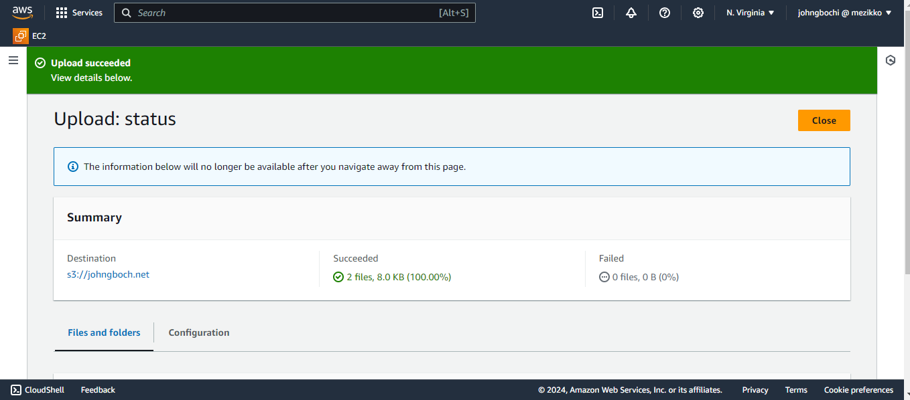


# STEP 3 - CREATING A CLOUDFRONT DISTRIBUTION AND DEPLOYING YOUR WEBSITE.

12. Navigate to the Services tab and search for CloudFront.


13. When the Dashboard comes up, click on **Create New Distribution**.

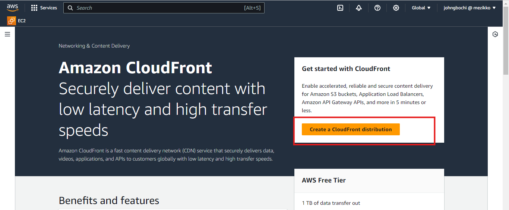

14. Then choose your origin domain name as the S3 you already created and check the box for **Origin Access Control**. 

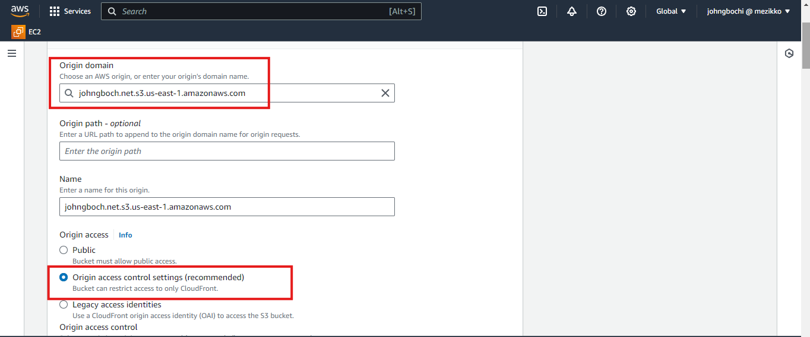

15. Click on Create OAC. When it loads, leave the settings at their default and click on **Create**

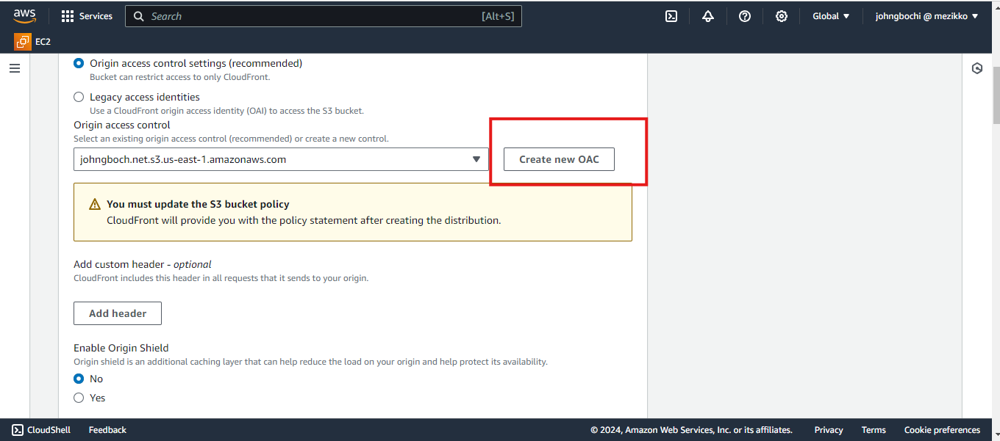

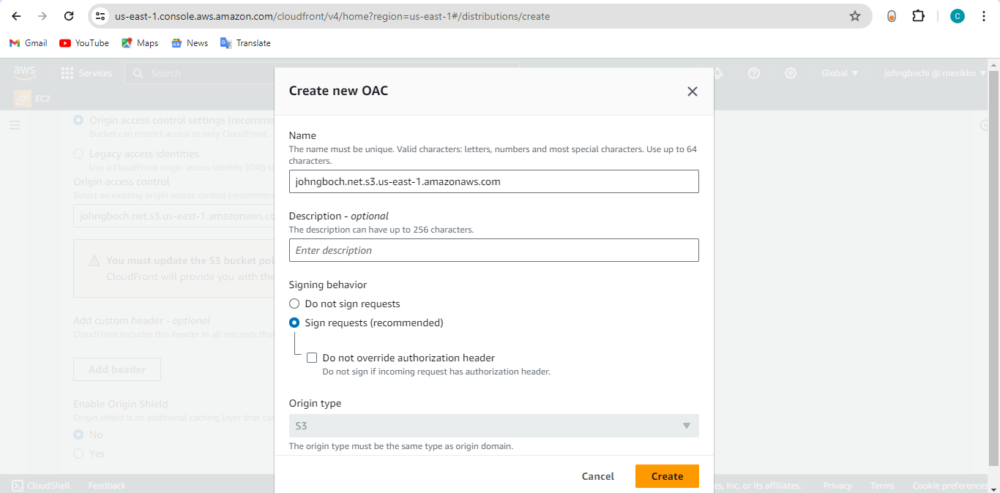


16. Then scroll down and also check the box for **Enable Security Protection**. Scroll down and type in the default root object and click on **Create Distribution**

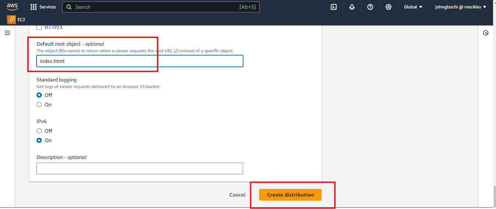


17. When you are done creating a distribution, you will be greeted with an interface as this. Click on **Copy Policy**

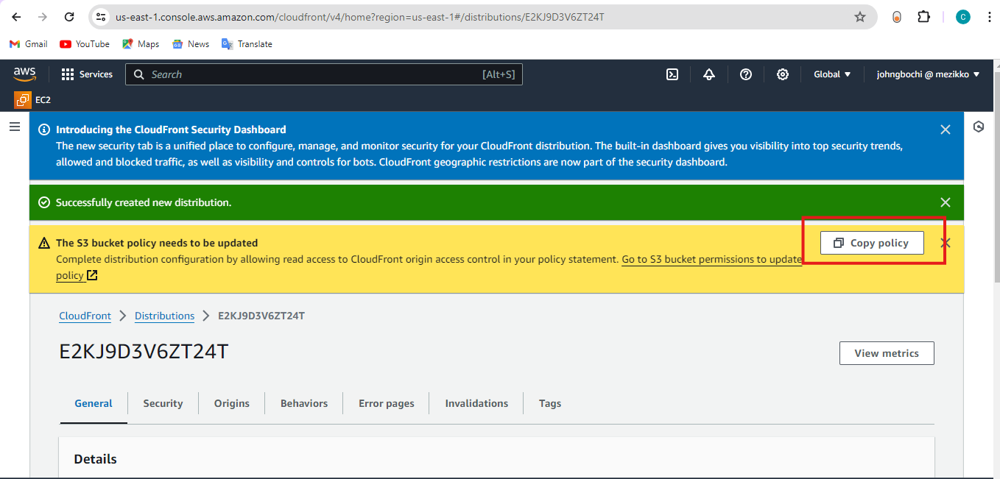

18. Then navigate back to the bucket you created. Click on the **Permission** tab, croll down to **Bucket Policy** and click on **Edit** Then Paste the policy you just copied from the CloudFront Distribution on the interface.

```
{
        "Version": "2008-10-17",
        "Id": "PolicyForCloudFrontPrivateContent",
        "Statement": [
            {
                "Sid": "AllowCloudFrontServicePrincipal",
                "Effect": "Allow",
                "Principal": {
                    "Service": "cloudfront.amazonaws.com"
                },
                "Action": "s3:GetObject",
                "Resource": "arn:aws:s3:::johngboch.net/*",
                "Condition": {
                    "StringEquals": {
                      "AWS:SourceArn": "arn:aws:cloudfront::211125493321:distribution/E2KJ9D3V6ZT24T"
                    }
                }
            }
        ]
      }
```
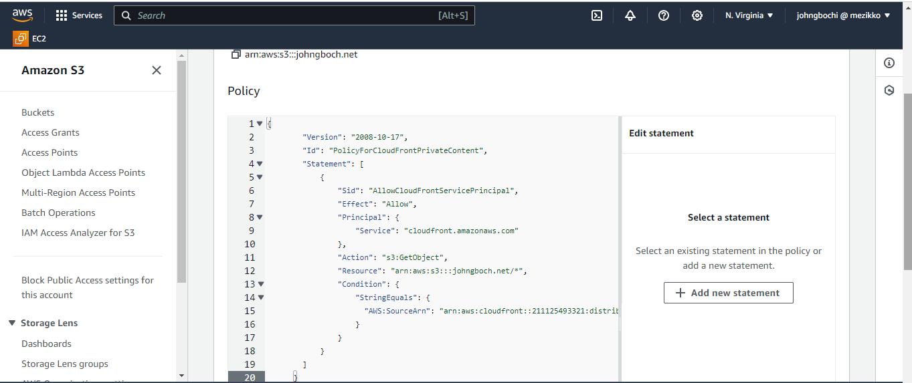


19. When you are done, scroll down and click on **Save Changes**.

20. Navigate back to your CloudFront distribution and copy the URL assigned to your bucket.


- Copy the URL.
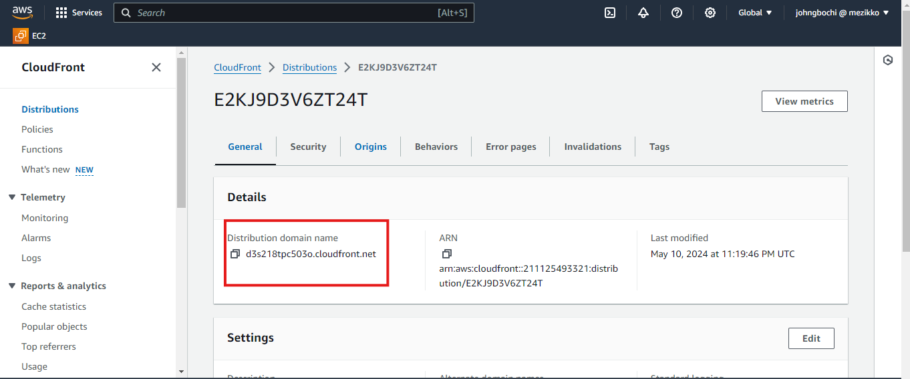

21. You can finally place the URL on your browser and view your website.


**Testing and Optimization:**

Once you have deployed your static website on AWS S3 with CloudFront, It's essential to test it's performance and optimize it for better user experience. Once the CloudFront distribution is deployed, you can test your website by accessing it through the CloudFront domain name or your custom domain (if configured). Verify that your website loads correctly and that CloudFront is serving the content efficiently. 